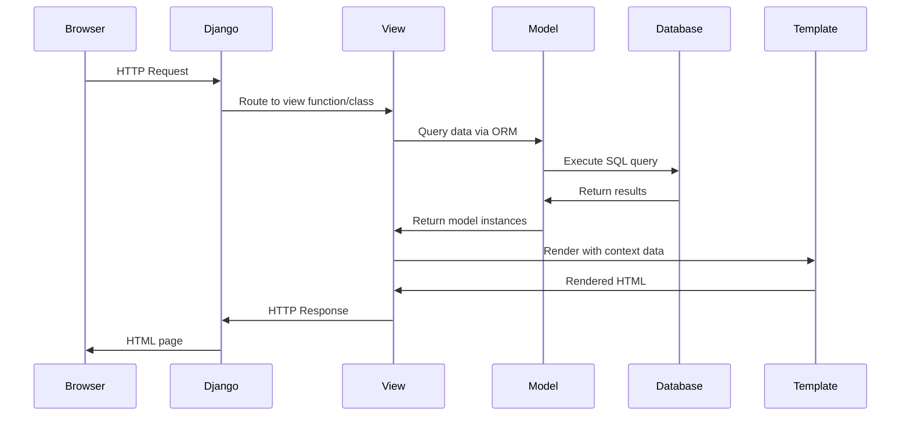
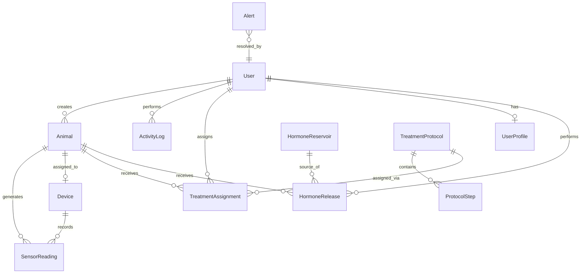

# Design Document: YakSync IoT Livestock Management Platform

## Overview

YakSync is a Django-based IoT livestock management platform that enables comprehensive tracking of animal health, hormone treatments, and IoT sensor data. The system follows a traditional Django monolithic architecture with server-side rendering, vanilla CSS/JavaScript, and Django ORM for data persistence.

### Key Design Principles

1. **Django Best Practices**: Follow Django conventions for project structure, URL routing, template inheritance, and ORM usage
2. **Modular Architecture**: Separate concerns into distinct Django apps with clear responsibilities
3. **Server-Side Rendering**: Use Django templates for all UI rendering (no React/Vue)
4. **Vanilla Styling**: Use custom CSS without Bootstrap or Tailwind frameworks
5. **Database Agnostic**: Design for SQLite (development) with PostgreSQL compatibility (production)
6. **Incremental Development**: Build and verify each module independently before integration

### Technology Stack

- **Backend Framework**: Django 4.x
- **Database**: SQLite (development), PostgreSQL-compatible schema
- **Template Engine**: Django Templates
- **Styling**: Vanilla CSS with professional government/medical dashboard aesthetic
- **Scripting**: Vanilla JavaScript (no frameworks)
- **Authentication**: Django's built-in authentication system
- **ORM**: Django ORM with model-based database schema

### Design Approach

The platform will be developed in phases, with Phase 1 focusing on:
- Complete Django project setup with all required apps
- Database schema design and migrations
- Authentication system implementation
- Base template system (sidebar, navbar, layouts)
- Professional UI styling with blue theme
- Dashboard and core CRUD operations for all entities


## Architecture

### Project Structure

```
yaksync/                          # Root project directory
├── manage.py                     # Django management script
├── yaksync_project/              # Main Django project configuration
│   ├── __init__.py
│   ├── settings.py              # Project settings
│   ├── urls.py                  # Root URL configuration
│   ├── wsgi.py                  # WSGI application
│   └── asgi.py                  # ASGI application (future use)
├── apps/                        # Django applications directory
│   ├── authentication/          # User authentication and authorization
│   ├── dashboard/               # Main dashboard and overview
│   ├── animals/                 # Animal records management
│   ├── devices/                 # IoT device management
│   ├── monitoring/              # Sensor data collection
│   ├── hormones/                # Hormone reservoir management
│   ├── protocols/               # Treatment protocol management
│   ├── alerts/                  # Alert and notification system
│   ├── reports/                 # Reports and analytics
│   └── logs/                    # Activity logging
├── templates/                   # Global templates
│   ├── base.html               # Base template with sidebar/navbar
│   ├── includes/               # Reusable template partials
│   │   ├── sidebar.html
│   │   ├── navbar.html
│   │   └── footer.html
│   └── errors/                 # Error pages
│       ├── 404.html
│       └── 500.html
├── static/                     # Static files
│   ├── css/
│   │   ├── base.css           # Base styles
│   │   ├── dashboard.css      # Dashboard-specific styles
│   │   ├── forms.css          # Form styles
│   │   └── auth.css           # Authentication page styles
│   ├── js/
│   │   └── main.js            # Global JavaScript
│   └── images/
│       └── logo.png           # Platform logo
└── media/                     # User-uploaded files (future)
```


### Application Architecture

The platform follows Django's MVT (Model-View-Template) pattern with clear separation of concerns:

1. **Models Layer**: Django ORM models define database schema and business logic
2. **Views Layer**: Django views handle HTTP requests, business logic, and template rendering
3. **Templates Layer**: Django templates render dynamic HTML with data from views
4. **URL Routing**: Django URL dispatcher maps URLs to views
5. **Forms Layer**: Django forms handle validation and rendering of input forms

### Django Apps Organization

Each app has a single, well-defined responsibility:

- **authentication**: User registration, login, logout, password management, session handling
- **dashboard**: System overview, statistics, recent activities, quick access navigation
- **animals**: CRUD operations for animal records, search, filtering
- **devices**: IoT device registration, assignment to animals, status monitoring
- **monitoring**: Sensor data collection, storage, visualization, trend analysis
- **hormones**: Hormone reservoir management, release tracking, inventory monitoring
- **protocols**: Treatment protocol definition, assignment, progress tracking
- **alerts**: Alert generation, notification, resolution, filtering
- **reports**: Report generation for animals, treatments, devices, sensors, users
- **logs**: User activity logging, audit trail, system event tracking

### Request Flow




## Components and Interfaces

### 1. Authentication App

**Purpose**: Handle user authentication, authorization, and session management

**Models**:
- Uses Django's built-in `User` model (django.contrib.auth.models.User)
- Custom `UserProfile` model (OneToOne with User) for extended user information

**Views**:
- `LoginView`: Handle user login (POST: authenticate, create session)
- `LogoutView`: Handle user logout (terminate session)
- `RegisterView`: Handle new user registration
- `ProfileView`: Display and edit user profile

**URLs**:
- `/auth/login/` → LoginView
- `/auth/logout/` → LogoutView
- `/auth/register/` → RegisterView
- `/auth/profile/` → ProfileView

**Templates**:
- `authentication/login.html`: Login form with centered card layout
- `authentication/register.html`: Registration form
- `authentication/profile.html`: User profile page

### 2. Dashboard App

**Purpose**: Provide system overview and quick access to key metrics

**Models**:
- No models (aggregates data from other apps)

**Views**:
- `DashboardView`: Aggregate and display system statistics

**URLs**:
- `/` → DashboardView (home page)
- `/dashboard/` → DashboardView

**Templates**:
- `dashboard/index.html`: Main dashboard with cards for metrics

**Data Aggregation**:
- Total animals count (from animals.Animal model)
- Active devices count (from devices.Device model)
- Recent alerts (from alerts.Alert model)
- Hormone reservoir levels (from hormones.HormoneReservoir model)
- Pending treatment assignments (from protocols.TreatmentAssignment model)
- Recent user activities (from logs.ActivityLog model)


### 3. Animals App

**Purpose**: Manage livestock records and information

**Models**:
- `Animal`: Core animal record model

**Views**:
- `AnimalListView`: Display paginated list of animals with search/filter
- `AnimalDetailView`: Display individual animal details
- `AnimalCreateView`: Create new animal record
- `AnimalUpdateView`: Edit existing animal record
- `AnimalDeleteView`: Delete animal record

**URLs**:
- `/animals/` → AnimalListView
- `/animals/<int:pk>/` → AnimalDetailView
- `/animals/create/` → AnimalCreateView
- `/animals/<int:pk>/update/` → AnimalUpdateView
- `/animals/<int:pk>/delete/` → AnimalDeleteView

**Templates**:
- `animals/animal_list.html`: List view with search/filter
- `animals/animal_detail.html`: Detailed animal information
- `animals/animal_form.html`: Create/edit form
- `animals/animal_confirm_delete.html`: Deletion confirmation

**Forms**:
- `AnimalForm`: ModelForm for animal creation and editing

### 4. Devices App

**Purpose**: Manage IoT devices and their assignments

**Models**:
- `Device`: IoT device record
- Relationship to `Animal` (ForeignKey)

**Views**:
- `DeviceListView`: Display all devices with status
- `DeviceDetailView`: Device details and assigned animal
- `DeviceCreateView`: Register new device
- `DeviceUpdateView`: Edit device information
- `DeviceAssignView`: Assign device to animal

**URLs**:
- `/devices/` → DeviceListView
- `/devices/<int:pk>/` → DeviceDetailView
- `/devices/create/` → DeviceCreateView
- `/devices/<int:pk>/update/` → DeviceUpdateView
- `/devices/<int:pk>/assign/` → DeviceAssignView

**Templates**:
- `devices/device_list.html`: Device list with status indicators
- `devices/device_detail.html`: Device details and communication history
- `devices/device_form.html`: Create/edit form
- `devices/device_assign.html`: Assignment form


### 5. Monitoring App

**Purpose**: Collect and display sensor data from IoT devices

**Models**:
- `SensorReading`: Individual sensor data point
- Relationships to `Device` and `Animal` (ForeignKey)

**Views**:
- `MonitoringDashboardView`: Overview of all sensor data
- `AnimalMonitoringView`: Sensor data for specific animal
- `SensorDataListView`: Paginated list of sensor readings
- `SensorDataChartView`: Return JSON data for charting

**URLs**:
- `/monitoring/` → MonitoringDashboardView
- `/monitoring/animal/<int:animal_id>/` → AnimalMonitoringView
- `/monitoring/data/` → SensorDataListView
- `/monitoring/chart/<int:animal_id>/` → SensorDataChartView

**Templates**:
- `monitoring/dashboard.html`: Monitoring overview
- `monitoring/animal_monitoring.html`: Animal-specific sensor data with charts
- `monitoring/sensor_data_list.html`: Tabular sensor data

### 6. Hormones App

**Purpose**: Manage hormone reservoirs and release tracking

**Models**:
- `HormoneReservoir`: Hormone storage container
- `HormoneRelease`: Individual hormone release event
- Relationship between Release and Reservoir (ForeignKey)

**Views**:
- `HormoneReservoirListView`: Display all reservoirs
- `HormoneReservoirDetailView`: Reservoir details and release history
- `HormoneReservoirCreateView`: Create new reservoir
- `HormoneReservoirUpdateView`: Edit reservoir
- `HormoneReleaseCreateView`: Record hormone release

**URLs**:
- `/hormones/reservoirs/` → HormoneReservoirListView
- `/hormones/reservoirs/<int:pk>/` → HormoneReservoirDetailView
- `/hormones/reservoirs/create/` → HormoneReservoirCreateView
- `/hormones/reservoirs/<int:pk>/update/` → HormoneReservoirUpdateView
- `/hormones/release/` → HormoneReleaseCreateView

**Templates**:
- `hormones/reservoir_list.html`: List of hormone reservoirs
- `hormones/reservoir_detail.html`: Reservoir details and history
- `hormones/reservoir_form.html`: Create/edit reservoir
- `hormones/release_form.html`: Record hormone release


### 7. Protocols App

**Purpose**: Define and manage treatment protocols

**Models**:
- `TreatmentProtocol`: Protocol definition
- `ProtocolStep`: Individual step within a protocol
- `TreatmentAssignment`: Assignment of protocol to animal
- Relationships: Protocol → Steps (OneToMany), Protocol ↔ Animals (ManyToMany via Assignment)

**Views**:
- `ProtocolListView`: Display all protocols
- `ProtocolDetailView`: Protocol details with steps
- `ProtocolCreateView`: Create new protocol
- `ProtocolUpdateView`: Edit protocol
- `ProtocolAssignView`: Assign protocol to animal
- `AssignmentListView`: View all treatment assignments
- `AssignmentUpdateView`: Update assignment progress

**URLs**:
- `/protocols/` → ProtocolListView
- `/protocols/<int:pk>/` → ProtocolDetailView
- `/protocols/create/` → ProtocolCreateView
- `/protocols/<int:pk>/update/` → ProtocolUpdateView
- `/protocols/<int:pk>/assign/` → ProtocolAssignView
- `/protocols/assignments/` → AssignmentListView
- `/protocols/assignments/<int:pk>/update/` → AssignmentUpdateView

**Templates**:
- `protocols/protocol_list.html`: Protocol list
- `protocols/protocol_detail.html`: Protocol details with steps
- `protocols/protocol_form.html`: Create/edit protocol
- `protocols/protocol_assign.html`: Assignment form
- `protocols/assignment_list.html`: Treatment assignments
- `protocols/assignment_form.html`: Update assignment status


### 8. Alerts App

**Purpose**: Generate and manage system alerts

**Models**:
- `Alert`: Alert record

**Views**:
- `AlertListView`: Display all alerts with filtering
- `AlertDetailView`: Alert details
- `AlertResolveView`: Mark alert as resolved

**URLs**:
- `/alerts/` → AlertListView
- `/alerts/<int:pk>/` → AlertDetailView
- `/alerts/<int:pk>/resolve/` → AlertResolveView

**Templates**:
- `alerts/alert_list.html`: Alert list with filters
- `alerts/alert_detail.html`: Alert details

**Alert Types**:
- Low Hormone Level
- Device Disconnection
- Low Battery
- Abnormal Reading
- Missed Schedule

### 9. Reports App

**Purpose**: Generate analytical reports

**Models**:
- No models (queries data from other apps)

**Views**:
- `ReportListView`: Available reports menu
- `AnimalHealthReportView`: Animal health report
- `TreatmentHistoryReportView`: Treatment history report
- `HormoneUsageReportView`: Hormone usage report
- `DevicePerformanceReportView`: Device performance report
- `SensorDataReportView`: Sensor data report
- `UserActivityReportView`: User activity report

**URLs**:
- `/reports/` → ReportListView
- `/reports/animal-health/` → AnimalHealthReportView
- `/reports/treatment-history/` → TreatmentHistoryReportView
- `/reports/hormone-usage/` → HormoneUsageReportView
- `/reports/device-performance/` → DevicePerformanceReportView
- `/reports/sensor-data/` → SensorDataReportView
- `/reports/user-activity/` → UserActivityReportView

**Templates**:
- `reports/report_list.html`: Report menu
- `reports/animal_health.html`: Animal health report
- `reports/treatment_history.html`: Treatment history report
- `reports/hormone_usage.html`: Hormone usage report
- `reports/device_performance.html`: Device performance report
- `reports/sensor_data.html`: Sensor data report
- `reports/user_activity.html`: User activity report


### 10. Logs App

**Purpose**: Track user activities and system events

**Models**:
- `ActivityLog`: User activity record

**Views**:
- `ActivityLogListView`: Display activity logs with filtering

**URLs**:
- `/logs/` → ActivityLogListView

**Templates**:
- `logs/activity_log_list.html`: Activity log list

**Logging Strategy**:
- Log all user actions (create, update, delete)
- Log authentication events (login, logout)
- Log alert generation and resolution
- Store: timestamp, user, action type, entity type, entity ID, description


## Data Models

### Database Schema Design

All models use Django ORM with appropriate field types, constraints, and relationships. The schema is designed for SQLite (development) with PostgreSQL compatibility.

### Authentication Models

**User** (Django built-in):
```python
# django.contrib.auth.models.User
- id: AutoField (primary key)
- username: CharField(max_length=150, unique=True)
- email: EmailField(unique=True)
- password: CharField(max_length=128)  # Hashed
- first_name: CharField(max_length=150)
- last_name: CharField(max_length=150)
- is_active: BooleanField(default=True)
- is_staff: BooleanField(default=False)
- is_superuser: BooleanField(default=False)
- date_joined: DateTimeField(auto_now_add=True)
- last_login: DateTimeField(null=True)
```

**UserProfile**:
```python
- id: AutoField (primary key)
- user: OneToOneField(User, on_delete=CASCADE)
- role: CharField(max_length=50)  # veterinarian, farm_operator, researcher
- phone: CharField(max_length=20, blank=True)
- organization: CharField(max_length=200, blank=True)
- created_at: DateTimeField(auto_now_add=True)
- updated_at: DateTimeField(auto_now=True)
```

### Animal Model

```python
- id: AutoField (primary key)
- animal_id: CharField(max_length=50, unique=True)
- name: CharField(max_length=100)
- species: CharField(max_length=50)
- breed: CharField(max_length=100)
- age: IntegerField()
- gender: CharField(max_length=10)  # male, female
- weight: DecimalField(max_digits=6, decimal_places=2)
- health_status: CharField(max_length=50)  # healthy, sick, under_treatment
- reproductive_status: CharField(max_length=50)  # pregnant, cycling, not_cycling
- registration_date: DateField(auto_now_add=True)
- created_at: DateTimeField(auto_now_add=True)
- updated_at: DateTimeField(auto_now=True)
- created_by: ForeignKey(User, on_delete=SET_NULL, null=True)
```

### Device Model

```python
- id: AutoField (primary key)
- device_id: CharField(max_length=50, unique=True)
- name: CharField(max_length=100)
- device_type: CharField(max_length=50)  # sensor, hormone_dispenser
- installation_location: CharField(max_length=200)
- status: CharField(max_length=20)  # active, inactive, maintenance
- battery_level: IntegerField(default=100)  # 0-100
- assigned_animal: ForeignKey(Animal, on_delete=SET_NULL, null=True, blank=True)
- last_communication: DateTimeField(null=True, blank=True)
- registration_date: DateTimeField(auto_now_add=True)
- created_at: DateTimeField(auto_now_add=True)
- updated_at: DateTimeField(auto_now=True)
```


### Monitoring Model

**SensorReading**:
```python
- id: AutoField (primary key)
- device: ForeignKey(Device, on_delete=CASCADE)
- animal: ForeignKey(Animal, on_delete=CASCADE)
- sensor_type: CharField(max_length=50)  # temperature, movement, reproductive_indicator
- value: DecimalField(max_digits=10, decimal_places=4)
- unit: CharField(max_length=20)  # celsius, steps, indicator_level
- timestamp: DateTimeField(auto_now_add=True)
- is_abnormal: BooleanField(default=False)
```

### Hormone Models

**HormoneReservoir**:
```python
- id: AutoField (primary key)
- hormone_type: CharField(max_length=100)
- initial_quantity: DecimalField(max_digits=10, decimal_places=2)
- current_quantity: DecimalField(max_digits=10, decimal_places=2)
- unit: CharField(max_length=20)  # ml, mg
- low_threshold: DecimalField(max_digits=10, decimal_places=2)
- created_at: DateTimeField(auto_now_add=True)
- updated_at: DateTimeField(auto_now=True)
```

**HormoneRelease**:
```python
- id: AutoField (primary key)
- reservoir: ForeignKey(HormoneReservoir, on_delete=CASCADE)
- animal: ForeignKey(Animal, on_delete=CASCADE)
- quantity: DecimalField(max_digits=10, decimal_places=2)
- timestamp: DateTimeField(auto_now_add=True)
- performed_by: ForeignKey(User, on_delete=SET_NULL, null=True)
- notes: TextField(blank=True)
```

### Protocol Models

**TreatmentProtocol**:
```python
- id: AutoField (primary key)
- name: CharField(max_length=200)
- description: TextField()
- duration_days: IntegerField()
- created_by: ForeignKey(User, on_delete=SET_NULL, null=True)
- created_at: DateTimeField(auto_now_add=True)
- updated_at: DateTimeField(auto_now=True)
```

**ProtocolStep**:
```python
- id: AutoField (primary key)
- protocol: ForeignKey(TreatmentProtocol, on_delete=CASCADE, related_name='steps')
- step_number: IntegerField()
- description: TextField()
- hormone_type: CharField(max_length=100)
- dosage: DecimalField(max_digits=10, decimal_places=2)
- day_offset: IntegerField()  # Days from protocol start
- time_of_day: TimeField()
```

**TreatmentAssignment**:
```python
- id: AutoField (primary key)
- protocol: ForeignKey(TreatmentProtocol, on_delete=CASCADE)
- animal: ForeignKey(Animal, on_delete=CASCADE)
- start_date: DateField()
- end_date: DateField()
- status: CharField(max_length=20)  # pending, in_progress, completed, cancelled
- progress: IntegerField(default=0)  # Percentage
- assigned_by: ForeignKey(User, on_delete=SET_NULL, null=True)
- created_at: DateTimeField(auto_now_add=True)
- updated_at: DateTimeField(auto_now=True)
```


### Alert Model

**Alert**:
```python
- id: AutoField (primary key)
- title: CharField(max_length=200)
- alert_type: CharField(max_length=50)  # low_hormone, device_disconnection, low_battery, abnormal_reading, missed_schedule
- severity: CharField(max_length=20)  # info, warning, critical
- description: TextField()
- related_entity_type: CharField(max_length=50)  # animal, device, reservoir, protocol
- related_entity_id: IntegerField()
- status: CharField(max_length=20)  # active, resolved
- timestamp: DateTimeField(auto_now_add=True)
- resolved_at: DateTimeField(null=True, blank=True)
- resolved_by: ForeignKey(User, on_delete=SET_NULL, null=True, blank=True)
```

### Activity Log Model

**ActivityLog**:
```python
- id: AutoField (primary key)
- user: ForeignKey(User, on_delete=SET_NULL, null=True)
- action_type: CharField(max_length=50)  # create, update, delete, login, logout
- entity_type: CharField(max_length=50)  # animal, device, protocol, etc.
- entity_id: IntegerField(null=True, blank=True)
- description: TextField()
- timestamp: DateTimeField(auto_now_add=True)
- ip_address: GenericIPAddressField(null=True, blank=True)
```

### Database Relationships Summary




## User Interface Design

### Design Philosophy

The UI follows a professional government/medical dashboard aesthetic with:
- Clean, spacious layouts with ample whitespace
- Professional blue color scheme (#2c3e50 for primary, #3498db for accents)
- Card-based information architecture
- Clear typography hierarchy
- Responsive design without frameworks
- Accessible color contrasts and focus indicators

### Base Template Structure

**base.html** - Master template with common layout:

```html
<!DOCTYPE html>
<html lang="en">
<head>
    <meta charset="UTF-8">
    <meta name="viewport" content="width=device-width, initial-scale=1.0">
    <title>YakSync</title>
    <link rel="stylesheet" href="">
    
</head>
<body>
    
    <div class="layout">
        <aside class="sidebar">
            
        </aside>
        <div class="main-content">
            <nav class="navbar">
                
            </nav>
            <main class="content">
                
            </main>
        </div>
    </div>
    
    <main class="auth-layout">
        
    </main>
    
    
    <script src=""></script>
    
</body>
</html>
```

### Sidebar Navigation

**includes/sidebar.html**:

- Platform logo and name
- Navigation menu with icons and labels
- Active state highlighting
- Grouped sections:
  - Dashboard
  - Animals
  - Devices
  - Monitoring
  - Hormones
  - Protocols
  - Alerts
  - Reports
  - Activity Logs

### Top Navbar

**includes/navbar.html**:

- Breadcrumb navigation
- Search bar (context-aware)
- User profile dropdown
  - Profile link
  - Settings link
  - Logout link
- Notification bell with badge count


### CSS Architecture

**base.css** - Global styles:
```css
/* CSS Variables for theming */
:root {
    --primary-color: #2c3e50;
    --secondary-color: #3498db;
    --accent-color: #1abc9c;
    --bg-color: #f5f7fa;
    --card-bg: #ffffff;
    --text-primary: #2c3e50;
    --text-secondary: #7f8c8d;
    --border-color: #e1e8ed;
    --success-color: #27ae60;
    --warning-color: #f39c12;
    --danger-color: #e74c3c;
    --sidebar-width: 250px;
    --navbar-height: 60px;
}

/* Layout */
.layout {
    display: flex;
    min-height: 100vh;
}

.sidebar {
    width: var(--sidebar-width);
    background: var(--primary-color);
    color: white;
    position: fixed;
    height: 100vh;
    overflow-y: auto;
}

.main-content {
    margin-left: var(--sidebar-width);
    flex: 1;
    display: flex;
    flex-direction: column;
}

.navbar {
    height: var(--navbar-height);
    background: var(--card-bg);
    border-bottom: 1px solid var(--border-color);
    position: sticky;
    top: 0;
    z-index: 100;
}

.content {
    padding: 2rem;
    background: var(--bg-color);
    flex: 1;
}

/* Cards */
.card {
    background: var(--card-bg);
    border-radius: 8px;
    box-shadow: 0 1px 3px rgba(0,0,0,0.1);
    padding: 1.5rem;
    margin-bottom: 1.5rem;
}

/* Forms */
.form-group {
    margin-bottom: 1.5rem;
}

.form-label {
    display: block;
    margin-bottom: 0.5rem;
    font-weight: 500;
    color: var(--text-primary);
}

.form-input {
    width: 100%;
    padding: 0.75rem;
    border: 1px solid var(--border-color);
    border-radius: 4px;
    font-size: 1rem;
}

.btn {
    padding: 0.75rem 1.5rem;
    border-radius: 4px;
    border: none;
    cursor: pointer;
    font-size: 1rem;
    transition: all 0.2s;
}

.btn-primary {
    background: var(--secondary-color);
    color: white;
}

.btn-primary:hover {
    background: #2980b9;
}
```


### Page Layouts

**Dashboard Layout**:
- Grid of metric cards (2x4 on desktop, 1 column on mobile)
- Each card displays: title, primary metric, trend indicator, link to detail view
- Recent alerts section (list of 5 most recent)
- Recent activities section (list of 10 most recent)
- Quick actions section (buttons for common tasks)

**List View Layout** (Animals, Devices, Protocols, etc.):
- Page header with title and "Add New" button
- Search bar and filter controls
- Data table with sortable columns
- Action buttons per row (view, edit, delete)
- Pagination controls at bottom

**Detail View Layout**:
- Page header with back button and edit button
- Information cards organized by category
- Related data sections (e.g., animal's sensor readings, assigned devices)
- Action buttons (edit, delete, assign, etc.)

**Form Layout**:
- Page header with title
- Form in centered card (max-width: 600px)
- Clear field labels and placeholders
- Validation error messages inline
- Submit and cancel buttons at bottom

**Login Page Layout**:
- Centered card on full-screen background
- Platform logo and name at top
- Username/email and password fields
- "Remember me" checkbox
- Login button
- Link to registration page
- Professional background gradient (blue theme)

### Responsive Design Breakpoints

```css
/* Mobile: < 768px */
@media (max-width: 767px) {
    .sidebar { display: none; /* Mobile menu toggle */ }
    .main-content { margin-left: 0; }
    .card-grid { grid-template-columns: 1fr; }
}

/* Tablet: 768px - 1024px */
@media (min-width: 768px) and (max-width: 1023px) {
    .card-grid { grid-template-columns: repeat(2, 1fr); }
}

/* Desktop: >= 1024px */
@media (min-width: 1024px) {
    .card-grid { grid-template-columns: repeat(4, 1fr); }
}
```


## Error Handling

### Form Validation

**Client-Side Validation**:
- HTML5 input validation attributes (required, pattern, min, max)
- JavaScript validation for complex rules
- Real-time feedback as user types
- Clear error messages below input fields

**Server-Side Validation**:
- Django form validation in ModelForm classes
- Custom validators for business rules
- Clean methods for field-level validation
- Clean method for form-level validation
- Return validation errors to template with form context

### Database Integrity

**Constraint Enforcement**:
- Unique constraints on animal_id, device_id fields
- Foreign key constraints with appropriate on_delete behaviors:
  - CASCADE: Delete dependent records (e.g., SensorReading when Device deleted)
  - SET_NULL: Preserve record but clear relationship (e.g., Animal.created_by when User deleted)
  - PROTECT: Prevent deletion if dependencies exist (use sparingly)
- Check constraints for data ranges (e.g., battery_level 0-100)

**Transaction Management**:
- Use Django's transaction.atomic() for multi-step operations
- Example: Hormone release (decrement reservoir, create release record, log activity)
- Rollback on any failure to maintain consistency

### HTTP Error Handling

**404 Not Found**:
- Custom 404.html template with helpful navigation
- Suggest related pages or search functionality
- Link back to dashboard

**500 Internal Server Error**:
- Custom 500.html template with generic error message
- Log full error details server-side
- Display user-friendly message without technical details
- Provide contact information for support

**403 Forbidden**:
- Custom 403.html for authorization failures
- Explain why access was denied
- Suggest appropriate action (contact admin, login)

**Error Logging**:
- Use Django's logging framework
- Log levels: DEBUG, INFO, WARNING, ERROR, CRITICAL
- Log to file in production
- Include: timestamp, user, request path, error type, stack trace


### Alert Generation Logic

**Low Hormone Level Alert**:
- Trigger: When HormoneReservoir.current_quantity <= low_threshold
- Check: After each HormoneRelease is saved
- Action: Create Alert with severity "warning" or "critical" based on percentage remaining

**Device Disconnection Alert**:
- Trigger: When Device.last_communication is older than expected interval (e.g., 1 hour)
- Check: Periodic task (Django management command or background job)
- Action: Create Alert with severity "warning"

**Low Battery Alert**:
- Trigger: When Device.battery_level < 20
- Check: When battery level is updated
- Action: Create Alert with severity "warning" (< 20) or "critical" (< 10)

**Abnormal Sensor Reading Alert**:
- Trigger: When SensorReading.value is outside normal range for sensor_type
- Check: When SensorReading is saved
- Action: Create Alert with severity based on deviation magnitude

**Missed Schedule Alert**:
- Trigger: When scheduled ProtocolStep is not completed on time
- Check: Periodic task checking TreatmentAssignment progress
- Action: Create Alert with severity "warning"

### Security Measures

**Authentication**:
- Use Django's built-in authentication (password hashing with PBKDF2)
- Require login for all views except login/register pages
- Use @login_required decorator on views
- Use LoginRequiredMixin for class-based views

**Authorization**:
- Check user permissions before allowing actions
- Use Django's permission system or custom authorization logic
- Validate user owns/can access requested resources

**CSRF Protection**:
- Enable CSRF middleware (Django default)
- Include  in all forms
- Use POST requests for state-changing operations

**SQL Injection Prevention**:
- Use Django ORM exclusively (parameterized queries)
- Never use raw SQL with string formatting
- If raw SQL needed, use parameterized queries with .raw()

**XSS Prevention**:
- Django template auto-escaping (enabled by default)
- Use |safe filter only for trusted content
- Validate and sanitize all user inputs

**Session Security**:
- Set SESSION_COOKIE_HTTPONLY = True
- Set SESSION_COOKIE_SECURE = True (production, HTTPS)
- Set SESSION_COOKIE_SAMESITE = 'Strict'
- Configure reasonable session timeout


## Testing Strategy

### Overview

Given the nature of this Django web application, testing will focus on unit tests for models and views, integration tests for workflows, and manual testing for UI/UX. Property-based testing is not applicable for this project as it involves:
- Infrastructure setup and configuration (Django project structure)
- Database operations (CRUD through ORM)
- UI rendering (template-based server-side rendering)
- External service integration (future IoT device communication)

### Unit Testing

**Model Tests** (Django TestCase):
- Test model creation with valid data
- Test model validation (unique constraints, required fields)
- Test model methods and properties
- Test model relationships (ForeignKey, ManyToMany)
- Test default values and auto fields
- Example: Create Animal with duplicate animal_id should raise IntegrityError

**View Tests** (Django TestCase or RequestFactory):
- Test view returns correct HTTP status codes
- Test view requires authentication (redirect to login)
- Test view renders correct template
- Test view context contains expected data
- Test view handles POST requests correctly
- Test view validation error handling
- Example: AnimalCreateView with invalid data returns form with errors

**Form Tests**:
- Test form validation with valid data (is_valid() = True)
- Test form validation with invalid data (is_valid() = False)
- Test form error messages
- Test form field rendering
- Example: AnimalForm with negative age should have validation error

**URL Tests**:
- Test URL patterns resolve to correct views
- Test reverse URL lookups work correctly
- Test URL parameters are passed correctly

### Integration Testing

**Authentication Flow**:
1. User registration → account created → user can login
2. User login → session created → user can access protected pages
3. User logout → session cleared → redirect to login page

**CRUD Workflows**:
1. Create animal → animal appears in list → can view detail
2. Edit animal → changes saved → updated data displayed
3. Delete animal → animal removed from list → 404 on detail view

**Multi-Step Workflows**:
1. Create protocol → add steps → assign to animal → track progress
2. Register device → assign to animal → record sensor reading → view in monitoring
3. Create hormone reservoir → perform release → quantity decremented → alert generated if low

**Alert Generation**:
1. Hormone release depletes reservoir below threshold → alert created
2. Device communication timestamp not updated → alert created (requires mock time)


### Database Testing

**Migration Tests**:
- Run makemigrations and verify no changes detected after migrations applied
- Run migrate and verify all tables created
- Test migration rollback (python manage.py migrate app_name zero)

**Schema Validation**:
- Verify all expected tables exist in database
- Verify foreign key constraints are enforced
- Verify unique constraints are enforced
- Use Django admin or database inspection tools

### Manual Testing

**UI/UX Testing**:
- Visual appearance matches design specifications
- Responsive layout works on different screen sizes
- Navigation works correctly (sidebar, navbar, breadcrumbs)
- Forms display correctly and provide feedback
- Error messages are clear and helpful
- Loading states and transitions are smooth

**Browser Compatibility**:
- Test on Chrome, Firefox, Safari, Edge
- Test on mobile browsers (Chrome Mobile, Safari Mobile)

**Accessibility Testing**:
- Keyboard navigation works
- Screen reader compatibility (ARIA labels where needed)
- Color contrast meets WCAG standards
- Focus indicators are visible

### Test Data Management

**Fixtures**:
- Create Django fixtures for common test scenarios
- Include sample animals, devices, protocols, users
- Use fixtures to quickly set up test environment

**Factory Pattern** (optional, using factory_boy):
- Create factory classes for models
- Generate test data with realistic values
- Support for related objects and dependencies

### Testing Tools

**Django Testing Framework**:
- Use django.test.TestCase for database-backed tests
- Use django.test.Client for view testing
- Use django.test.RequestFactory for isolated view tests

**Coverage Tool**:
- Use coverage.py to measure test coverage
- Aim for >80% coverage on models and views
- Generate HTML coverage reports

**Testing Commands**:
```bash
# Run all tests
python manage.py test

# Run specific app tests
python manage.py test apps.animals

# Run with coverage
coverage run --source='.' manage.py test
coverage report
coverage html
```


### Phase 1 Testing Priorities

**Critical Path Tests**:
1. User authentication (login/logout) - MUST work
2. Animal CRUD operations - MUST work
3. Database migrations - MUST apply cleanly
4. Template rendering - MUST display without errors
5. Static files loading - MUST serve CSS/JS correctly

**Secondary Tests**:
1. Form validation error handling
2. Search and filter functionality
3. Pagination
4. Activity logging
5. Basic dashboard statistics

**Deferred to Later Phases**:
1. IoT device communication simulation
2. Sensor data visualization charts
3. Report generation with complex queries
4. Email notifications (not in Phase 1 scope)
5. Background task processing

## Implementation Notes

### Django Settings Configuration

**Key settings.py configurations**:

```python
# Application definition
INSTALLED_APPS = [
    'django.contrib.admin',
    'django.contrib.auth',
    'django.contrib.contenttypes',
    'django.contrib.sessions',
    'django.contrib.messages',
    'django.contrib.staticfiles',
    # YakSync apps
    'apps.authentication',
    'apps.dashboard',
    'apps.animals',
    'apps.devices',
    'apps.monitoring',
    'apps.hormones',
    'apps.protocols',
    'apps.alerts',
    'apps.reports',
    'apps.logs',
]

# Database
DATABASES = {
    'default': {
        'ENGINE': 'django.db.backends.sqlite3',
        'NAME': BASE_DIR / 'db.sqlite3',
    }
}

# Static files
STATIC_URL = '/static/'
STATICFILES_DIRS = [BASE_DIR / 'static']
STATIC_ROOT = BASE_DIR / 'staticfiles'

# Templates
TEMPLATES = [
    {
        'BACKEND': 'django.template.backends.django.DjangoTemplates',
        'DIRS': [BASE_DIR / 'templates'],
        'APP_DIRS': True,
        'OPTIONS': {
            'context_processors': [
                'django.template.context_processors.debug',
                'django.template.context_processors.request',
                'django.contrib.auth.context_processors.auth',
                'django.contrib.messages.context_processors.messages',
            ],
        },
    },
]

# Authentication
LOGIN_URL = '/auth/login/'
LOGIN_REDIRECT_URL = '/'
LOGOUT_REDIRECT_URL = '/auth/login/'

# Security
SECRET_KEY = 'django-insecure-dev-key'  # Change in production
DEBUG = True  # False in production
ALLOWED_HOSTS = ['localhost', '127.0.0.1']

# Session
SESSION_COOKIE_AGE = 86400  # 24 hours
SESSION_SAVE_EVERY_REQUEST = True
```


### URL Routing Strategy

**Root urls.py**:
```python
from django.contrib import admin
from django.urls import path, include

urlpatterns = [
    path('admin/', admin.site.urls),
    path('', include('apps.dashboard.urls')),
    path('auth/', include('apps.authentication.urls')),
    path('animals/', include('apps.animals.urls')),
    path('devices/', include('apps.devices.urls')),
    path('monitoring/', include('apps.monitoring.urls')),
    path('hormones/', include('apps.hormones.urls')),
    path('protocols/', include('apps.protocols.urls')),
    path('alerts/', include('apps.alerts.urls')),
    path('reports/', include('apps.reports.urls')),
    path('logs/', include('apps.logs.urls')),
]
```

**App-level urls.py pattern**:
```python
# Example: apps/animals/urls.py
from django.urls import path
from . import views

app_name = 'animals'

urlpatterns = [
    path('', views.AnimalListView.as_view(), name='list'),
    path('<int:pk>/', views.AnimalDetailView.as_view(), name='detail'),
    path('create/', views.AnimalCreateView.as_view(), name='create'),
    path('<int:pk>/update/', views.AnimalUpdateView.as_view(), name='update'),
    path('<int:pk>/delete/', views.AnimalDeleteView.as_view(), name='delete'),
]
```

**Template URL usage**:
```html
<a href="">All Animals</a>
<a href="">View Animal</a>
<a href="">Add Animal</a>
```

### View Patterns

**Class-Based Views**:
- Use Django generic views for standard CRUD operations
- CreateView, UpdateView, DeleteView, ListView, DetailView
- Override get_context_data() to add extra context
- Override form_valid() to add custom logic after form submission

**Function-Based Views**:
- Use for complex logic or non-standard workflows
- Use @login_required decorator
- Return render() with template and context

**Example CreateView**:
```python
from django.contrib.auth.mixins import LoginRequiredMixin
from django.views.generic import CreateView
from django.urls import reverse_lazy
from .models import Animal
from .forms import AnimalForm

class AnimalCreateView(LoginRequiredMixin, CreateView):
    model = Animal
    form_class = AnimalForm
    template_name = 'animals/animal_form.html'
    success_url = reverse_lazy('animals:list')
    
    def form_valid(self, form):
        form.instance.created_by = self.request.user
        return super().form_valid(form)
```


### Form Patterns

**ModelForm Pattern**:
```python
from django import forms
from .models import Animal

class AnimalForm(forms.ModelForm):
    class Meta:
        model = Animal
        fields = ['animal_id', 'name', 'species', 'breed', 'age', 
                  'gender', 'weight', 'health_status', 'reproductive_status']
        widgets = {
            'animal_id': forms.TextInput(attrs={'class': 'form-input', 'placeholder': 'e.g., YAK-001'}),
            'name': forms.TextInput(attrs={'class': 'form-input', 'placeholder': 'Animal name'}),
            'age': forms.NumberInput(attrs={'class': 'form-input', 'min': '0'}),
            'weight': forms.NumberInput(attrs={'class': 'form-input', 'step': '0.01'}),
        }
    
    def clean_age(self):
        age = self.cleaned_data.get('age')
        if age and age < 0:
            raise forms.ValidationError("Age cannot be negative")
        return age
```

**Template Form Rendering**:
```html
<form method="post">
    
    <div class="form-group">
        <label class="form-label">{{ form.animal_id.label }}</label>
        {{ form.animal_id }}
        
            <div class="form-error">{{ form.animal_id.errors }}</div>
        
    </div>
    <!-- Repeat for other fields -->
    <button type="submit" class="btn btn-primary">Save</button>
    <a href="" class="btn btn-secondary">Cancel</a>
</form>
```

### Activity Logging Pattern

**Logging Utility** (apps/logs/utils.py):
```python
from .models import ActivityLog

def log_activity(user, action_type, entity_type, entity_id, description):
    ActivityLog.objects.create(
        user=user,
        action_type=action_type,
        entity_type=entity_type,
        entity_id=entity_id,
        description=description
    )
```

**Usage in Views**:
```python
from apps.logs.utils import log_activity

def form_valid(self, form):
    response = super().form_valid(form)
    log_activity(
        user=self.request.user,
        action_type='create',
        entity_type='animal',
        entity_id=self.object.id,
        description=f"Created animal: {self.object.name}"
    )
    return response
```


### Dashboard Aggregation Pattern

**Dashboard View Example**:
```python
from django.contrib.auth.mixins import LoginRequiredMixin
from django.views.generic import TemplateView
from apps.animals.models import Animal
from apps.devices.models import Device
from apps.alerts.models import Alert
from apps.hormones.models import HormoneReservoir
from apps.protocols.models import TreatmentAssignment
from apps.logs.models import ActivityLog

class DashboardView(LoginRequiredMixin, TemplateView):
    template_name = 'dashboard/index.html'
    
    def get_context_data(self, **kwargs):
        context = super().get_context_data(**kwargs)
        
        # Aggregate statistics
        context['total_animals'] = Animal.objects.count()
        context['active_devices'] = Device.objects.filter(status='active').count()
        context['total_devices'] = Device.objects.count()
        
        # Recent alerts (last 5)
        context['recent_alerts'] = Alert.objects.filter(
            status='active'
        ).order_by('-timestamp')[:5]
        
        # Hormone reservoir levels
        context['hormone_reservoirs'] = HormoneReservoir.objects.all()
        
        # Pending treatment assignments
        context['pending_treatments'] = TreatmentAssignment.objects.filter(
            status='pending'
        ).select_related('protocol', 'animal')[:5]
        
        # Recent activities (last 10)
        context['recent_activities'] = ActivityLog.objects.select_related(
            'user'
        ).order_by('-timestamp')[:10]
        
        # Device health percentage
        if context['total_devices'] > 0:
            context['device_health'] = (
                context['active_devices'] / context['total_devices'] * 100
            )
        else:
            context['device_health'] = 0
        
        return context
```

### Search and Filter Pattern

**Search Implementation**:
```python
from django.db.models import Q

class AnimalListView(LoginRequiredMixin, ListView):
    model = Animal
    template_name = 'animals/animal_list.html'
    context_object_name = 'animals'
    paginate_by = 20
    
    def get_queryset(self):
        queryset = super().get_queryset()
        
        # Search
        search_query = self.request.GET.get('search', '')
        if search_query:
            queryset = queryset.filter(
                Q(animal_id__icontains=search_query) |
                Q(name__icontains=search_query) |
                Q(species__icontains=search_query)
            )
        
        # Filters
        species = self.request.GET.get('species', '')
        if species:
            queryset = queryset.filter(species=species)
        
        health_status = self.request.GET.get('health_status', '')
        if health_status:
            queryset = queryset.filter(health_status=health_status)
        
        return queryset.order_by('-registration_date')
    
    def get_context_data(self, **kwargs):
        context = super().get_context_data(**kwargs)
        context['search_query'] = self.request.GET.get('search', '')
        context['species_filter'] = self.request.GET.get('species', '')
        context['health_status_filter'] = self.request.GET.get('health_status', '')
        return context
```


### JavaScript Patterns

**main.js** - Global utilities:
```javascript
// Confirm delete actions
function confirmDelete(event, itemName) {
    if (!confirm(`Are you sure you want to delete ${itemName}?`)) {
        event.preventDefault();
        return false;
    }
    return true;
}

// Auto-dismiss messages after 5 seconds
document.addEventListener('DOMContentLoaded', function() {
    const messages = document.querySelectorAll('.message');
    messages.forEach(function(message) {
        setTimeout(function() {
            message.style.opacity = '0';
            setTimeout(function() {
                message.remove();
            }, 300);
        }, 5000);
    });
});

// Mobile sidebar toggle
const sidebarToggle = document.getElementById('sidebar-toggle');
const sidebar = document.querySelector('.sidebar');

if (sidebarToggle) {
    sidebarToggle.addEventListener('click', function() {
        sidebar.classList.toggle('active');
    });
}

// Form submission with loading state
function handleFormSubmit(formElement) {
    const submitButton = formElement.querySelector('button[type="submit"]');
    submitButton.disabled = true;
    submitButton.textContent = 'Saving...';
}
```

### Future Enhancements (Post-Phase 1)

**Background Tasks**:
- Use Celery for periodic alert checks
- Schedule device communication checks
- Generate scheduled reports

**Real-Time Updates**:
- Use Django Channels for WebSocket connections
- Push real-time sensor data to dashboard
- Live alert notifications

**API Endpoints**:
- Create REST API for IoT device communication
- Use Django REST Framework
- Separate API endpoints from web UI

**Advanced Analytics**:
- Use Chart.js or D3.js for visualizations
- Trend analysis algorithms
- Predictive analytics for hormone scheduling

**Email Notifications**:
- Send email alerts for critical conditions
- Use Django's email backend
- Configure SMTP settings

**File Uploads**:
- Animal photos
- Document attachments for protocols
- Report exports (CSV, PDF)

**Multi-tenancy** (if needed):
- Separate data by organization
- Organization-level permissions
- Organization admin role

